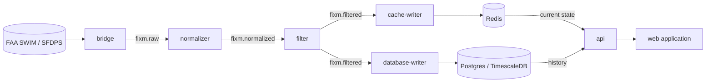

# nas-pipeline

A streaming data pipeline that ingests live **FAA SWIM (SFDPS)** flight data,
normalizes and filters it, and serves active aircraft to a live web application.

## About

_Why this exists:_ Living near an airport sparked my curiosity about the
technology behind air traffic management. I built nas-pipeline both to explore how
live aviation data moves through a real system and to deepen my hands-on
experience with production-grade practices across streaming, observability, and infrastructure.

What it's built to demonstrate; the design goals it deliberately targets:

- **Decoupled services over Kafka.** Each stage is small and single-purpose,
  connected only by topics, so any one can be changed, scaled, or restarted
  independently.
- **Production plumbing from day one.** Structured logging, Prometheus metrics,
  health probes, bounded retries, and dead-letter queues which are all
  encapsulated through one `platform/` module rather than copy-pasted.
- **Correctness under failure.** At-least-once delivery keyed by GUFI, so a
  repeated message updates the same flight instead of duplicating it, and
  fail-closed LADD compliance that refuses to forward without a current block list.
- **Self-hosted end to end.** k3s and a Cloudflare tunnel instead of a managed
  cloud, chosen to avoid the long-term cost of a 24/7 stream but built to stay
  cloud-deployable with infrastructure changes.

## Contents

- [Architecture](#architecture)
- [Data flow, end to end](#data-flow-end-to-end)
- [Observability & reliability](#observability--reliability)
- [Getting started](#getting-started)
- [Testing](#testing)
- [Data & compliance](#data--compliance)
- [Deployment](#deployment)
- [Documentation](#documentation)
- [Full docs index](docs/README.md)
- [License](#license)

## Architecture

Data flows through Kafka topics, one stage per service:



Each stage is a small, single-purpose service connected only by Kafka topics, so
any one can be changed, scaled, or restarted independently.

| Service | Lang | Role | Docs |
|---|---|---|---|
| `bridge` | Java / Spring Boot | SWIM (JMS) → Kafka `fixm.raw` | [README](bridge/README.md) |
| `normalizer` | Go | FIXM XML → per-flight JSON → `fixm.normalized` | [README](normalizer/README.md) |
| `filter` | Go | LADD compliance filter → `fixm.filtered` | [README](filter/README.md) |
| `cache-writer` | Go | `fixm.filtered` → Redis (live current state) | [README](cache-writer/README.md) |
| `database-writer` | Go | `fixm.filtered` → Postgres/TimescaleDB (history) | [README](database-writer/README.md) |
| `api` | Go / Gin | REST read API over Redis (live) + Postgres (history) | [README](api/README.md) |
| `web` | React / TS / MapLibre | web application (live flight map) | [README](web/README.md) |

### Control plane

Outside the data flow, one service manages sensitive configuration:

| Service | Lang | Role | Docs |
|---|---|---|---|
| `ladd-admin` | Go | secure LADD-list upload service + CLI | [README](ladd-admin/README.md) |

`ladd-admin` lets an operator upload a fresh LADD list from anywhere,
**encrypted and signed**, and updates the `ladd` Secret that `filter`
hot-reloads. It never touches the data plane; the two communicate only through
the Secret.

## Data flow, end to end

1. **bridge** pulls raw FIXM XML off SWIM (JMS) and forwards it to `fixm.raw`
   (at-least-once: ack only after the Kafka write).
2. **normalizer** parses each XML envelope into clean per-flight JSON on
   `fixm.normalized`, keyed by GUFI.
3. **filter** drops any aircraft on the LADD block list and forwards the rest to
   `fixm.filtered`, failing closed if the list is missing or stale.
4. **cache-writer** keeps Redis a live, self-expiring view: one hash per flight
   with a TTL, so the keys in Redis *are* the aircraft currently in the air.
5. **database-writer** records each flight and position into Postgres/TimescaleDB
   for durable history.
6. **api** serves both the live view (Redis) and historical queries (Postgres) as JSON.
7. **web** polls the api every few seconds and renders the MapLibre map.

## Observability & reliability

A shared [`platform/`](platform/README.md) Go module gives every service the same
production plumbing, imported rather than copy-pasted:

- **structured logging** (`log/slog`, JSON to stdout)
- **Prometheus metrics** + Kubernetes **health probes** (`/metrics`, `/healthz`, `/readyz`)
- **bounded retry** (exponential backoff + jitter) for transient failures
- **dead-letter** publishing for poison messages → `*.dlq` topics

Each consumer owns its own failure classification: *transient* errors retry,
*poison* messages are dead-lettered, so one bad message can never stall a
partition. Metrics are scraped by **Prometheus** and rendered in **Grafana**
(a dashboard per service, plus consumer-group lag via **kafka-exporter**).

## Getting started

```bash
make up          # infra (Kafka, Redis, Postgres) + topics
make services    # bridge, normalizer, filter, cache-writer, api
make web         # the front-end
```

Requires Docker, Go, a JDK, and Node. Full local setup, the dev UIs, and the
complete dev/production port maps are in
[docs/getting-started.md](docs/getting-started.md).

## Testing

```bash
make test    # unit tests for every Go module
```

CI runs the same on every push. See [docs/testing.md](docs/testing.md) for the full
strategy: the test pyramid, the integration/E2E plans, and the synthetic-input
pattern that lets the whole pipeline be tested without real SWIM credentials.

## Data & compliance

- **SWIM credentials** and the **LADD Industry file (CUI)** are **not** included in
  this repo. They are injected/mounted at runtime (env vars, and the `ladd`
  Secret for LADD). The `filter` service **fails closed** if the LADD list is
  missing or stale.
- LADD updates are delivered securely via **`ladd-admin`** (encrypted + signed
  uploads); see its README.
- Never commit `.env` files or anything under `data/`.

## Deployment

Each service has a multi-stage, non-root `Dockerfile`; the same images serve both
local and production.

- **Local dev:** `docker-compose` for infra plus the `make` targets (see
  [docs/getting-started.md](docs/getting-started.md)).
- **Production:** Kubernetes via **Kustomize**: a shared `base/` plus a `prod`
  overlay under `deploy/k8s/`. `deploy/deploy.sh` builds the images and applies
  the prod overlay on the server.

Secrets (`swim`, `ladd`, and the `ladd-admin` keys) are created out-of-band and
never committed. See the per-service READMEs above for details.

## Documentation

Per-service reference lives in each service's `README.md`. Cross-cutting docs (the
post-mortems and the roadmap) live under [`docs/`](docs/README.md):

- [docs/post-mortems/](docs/post-mortems/): incident write-ups (problem, root
  cause, and the proposed fix).
- [docs/roadmap.md](docs/roadmap.md): known limitations and planned work.

## License

[MIT](LICENSE).
