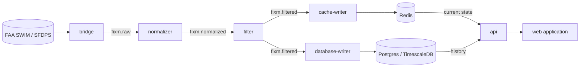

# nas-pipeline

A streaming data pipeline that ingests live **FAA SWIM (SFDPS)** flight data,
normalizes and filters it, and serves active aircraft to a live web application.

## Architecture

Data flows through Kafka topics, one stage per service:



Each stage is a small, single-purpose service connected only by Kafka topics, so
any one can be changed, scaled, or restarted independently.

| Service | Lang | Role | Docs |
|---|---|---|---|
| `bridge` | Java / Spring Boot | SWIM (JMS) → Kafka `fixm.raw` | [README](bridge/README.md) |
| `normalizer` | Go | FIXM XML → per-flight JSON → `fixm.normalized` | [README](normalizer/README.md) |
| `filter` | Go | LADD compliance filter → `fixm.filtered` | [README](filter/README.md) |
| `cache-writer` | Go | `fixm.filtered` → Redis (live current state) | [README](cache-writer/README.md) |
| `database-writer` | Go | `fixm.filtered` → Postgres/TimescaleDB (history) | — |
| `api` | Go / Gin | REST read API over Redis (live) + Postgres (history) | [README](api/README.md) |
| `web` | React / TS / MapLibre | web application (live flight map) | [README](web/README.md) |

### Control plane

Outside the data flow, one service manages sensitive configuration:

| Service | Lang | Role | Docs |
|---|---|---|---|
| `ladd-admin` | Go | secure LADD-list upload service + CLI | [README](ladd-admin/README.md) |

`ladd-admin` lets an operator upload a fresh LADD list from anywhere —
**encrypted and signed** — and updates the `ladd` Secret that `filter`
hot-reloads. It never touches the data plane; the two communicate only through
the Secret.

## Data flow, end to end

1. **bridge** pulls raw FIXM XML off SWIM (JMS) and forwards it to `fixm.raw`
   (at-least-once: ack only after the Kafka write).
2. **normalizer** parses each XML envelope into clean per-flight JSON on
   `fixm.normalized`, keyed by GUFI.
3. **filter** drops any aircraft on the LADD block list and forwards the rest to
   `fixm.filtered` — failing closed if the list is missing or stale.
4. **cache-writer** keeps Redis a live, self-expiring view: one hash per flight
   with a TTL, so the keys in Redis *are* the aircraft currently in the air.
5. **database-writer** records each flight and position into Postgres/TimescaleDB
   for durable history.
6. **api** serves both the live view (Redis) and historical queries (Postgres) as JSON.
7. **web** polls the api every few seconds and renders the MapLibre map.

## Observability & reliability

A shared **`platform/`** Go module gives every service the same production
plumbing — imported, not copy-pasted:

- **structured logging** (`log/slog`, JSON to stdout)
- **Prometheus metrics** + Kubernetes **health probes** (`/metrics`, `/healthz`, `/readyz`)
- **bounded retry** (exponential backoff + jitter) for transient failures
- **dead-letter** publishing for poison messages → `*.dlq` topics

Each consumer owns its own failure classification: *transient* errors retry,
*poison* messages are dead-lettered, so one bad message can never stall a
partition. Metrics are scraped by **Prometheus** and rendered in **Grafana**
(a dashboard per service, plus consumer-group lag via **kafka-exporter**).

## Quick start (local dev)

Requires Docker, Go, a JDK, and Node.

```bash
make up          # start infra (Kafka, Redis, Postgres) + create topics
make services    # run bridge, normalizer, filter, cache-writer, api
make web         # run the front-end
```

Local UIs: web `:5173` · API `:8090` · Grafana `:3000` · Kafka UI `:8080` · RedisInsight `:5540`.
Run `make help` for all targets.

## Ports

### Development (local)

Infra runs in Docker Compose (`make up`); the services run on the host
(`make services` / `make web`). Compose ports below are `host → container`.

**Infra — Docker Compose** (browse at `localhost:<host port>`)

| Container | Host | Container | Purpose |
|---|---|---|---|
| kafka | 9092 | 9092 | broker (external listener) |
| kafka | — | 29092 | broker (internal listener; not published) |
| redis | 6379 | 6379 | live cache |
| postgres | 5433 | 5432 | history DB (5433 avoids a native Postgres on 5432) |
| kafka-ui | 8080 | 8080 | Kafka UI |
| redis-insight | 5540 | 5540 | Redis UI |
| pgweb | 8081 | 8081 | Postgres UI |
| prometheus | 9090 | 9090 | metrics store |
| grafana | 3000 | 3000 | dashboards |
| kafka-exporter | 9308 | 9308 | consumer-group lag |

**Services — on the host** (each service binds these on `localhost`)

| Service | Port | Purpose |
|---|---|---|
| bridge | — | none (Solace JMS → Kafka) |
| normalizer | 2112 | ops: `/metrics`, `/healthz`, `/readyz` |
| filter | 2113 | ops |
| cache-writer | 2114 | ops |
| database-writer | 2115 | ops |
| api | 8090 | REST API + ops (`/metrics`, `/healthz`, `/readyz`) |
| ladd-admin | 8092 | upload API + ops (control plane; run on demand) |
| web | 5173 | Vite dev server |

Each host service uses a distinct ops port because they share one host. In
Kubernetes every service is its own pod, so they all use `2112`.

### Production (Kubernetes)

**In-cluster** — reachable only inside the cluster (ClusterIP / container ports):

| Service | Port | Notes |
|---|---|---|
| kafka | 29092 | internal listener |
| redis | 6379 | |
| postgres | 5432 | |
| normalizer / filter / cache-writer / database-writer | 2112 | ops (probes + scraping) |
| api | 8090 | ClusterIP — **not** exposed externally |
| ladd-admin | 8092 | container/Service target port |
| web | 80 | container port |

**External** — exposed on the host/network via `LoadBalancer` (prod overlay):

| Service | External port | → target |
|---|---|---|
| web | 15000 | → 80 |
| ladd-admin | 15002 | → 8092 |

Everything else (Kafka, Redis, Postgres, the writers' ops ports, and the api)
stays cluster-internal. Monitoring (Prometheus/Grafana/kafka-exporter) is
Compose-only today; running it in-cluster is a separate step.

## Testing

```bash
make test    # unit tests for every Go module
```

CI runs the same on every push. See [TESTING.md](TESTING.md) for the full
strategy — the test pyramid, the integration/E2E plans, and the synthetic-input
pattern that lets the whole pipeline be tested without real SWIM credentials.

## Data & compliance

- **SWIM credentials** and the **LADD Industry file (CUI)** are **not** included in
  this repo. They are injected/mounted at runtime (env vars, and the `ladd`
  Secret for LADD). The `filter` service **fails closed** if the LADD list is
  missing or stale.
- LADD updates are delivered securely via **`ladd-admin`** (encrypted + signed
  uploads) — see its README.
- Never commit `.env` files or anything under `data/`.

## Deployment

Each service has a multi-stage, non-root `Dockerfile`; the same images serve both
local and production.

- **Local dev:** `docker-compose` for infra + the `make` targets above, or the
  `dev` overlay on a local k3d cluster.
- **Production:** Kubernetes via **Kustomize** — a shared `base/` plus `dev` and
  `prod` overlays under `deploy/k8s/`. `deploy/deploy.sh` builds the images and
  applies the prod overlay on the server. A running log of the k8s setup and
  gotchas lives in [`deploy/help/help.txt`](deploy/help/help.txt).

Secrets (`swim`, `ladd`, and the `ladd-admin` keys) are created out-of-band and
never committed. See the per-service READMEs above for details.

## License

[MIT](LICENSE).
