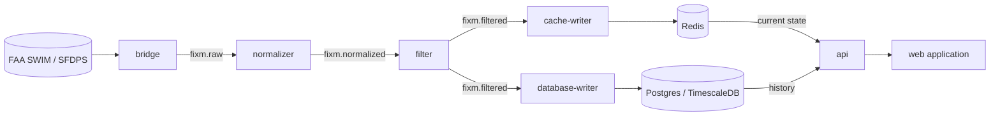

# nas-pipeline

A streaming data pipeline that ingests live **FAA SWIM (SFDPS)** flight data,
normalizes and filters it, and serves active aircraft to a live web application.

## Architecture

Data flows through Kafka topics, one stage per service:



| Service | Lang | Role |
|---|---|---|
| `bridge` | Java / Spring Boot | SWIM (JMS) → Kafka `fixm.raw` |
| `normalizer` | Go | FIXM XML → JSON, one message per flight → `fixm.normalized` |
| `filter` | Go | LADD compliance filter → `fixm.filtered` |
| `cache-writer` | Go | `fixm.filtered` → Redis (live current state) |
| `database-writer` | Go | `fixm.filtered` → Postgres/TimescaleDB (history) |
| `api` | Go / Gin | REST read API over Redis (current state) + Postgres/TimescaleDB (history) |
| `web` | React / TS / MapLibre | web application (live flight map) |

## Quick start (local dev)

Requires Docker, Go, a JDK, and Node.

```bash
make up          # start infra (Kafka, Redis, Postgres) + create topics
make services    # run bridge, normalizer, filter, cache-writer, api
make web         # run the front-end
```

Local UIs: web `:5173` · API `:8090` · Kafka UI `:8080` · RedisInsight `:5540`.
Run `make help` for all targets.

## Data & compliance

- **SWIM credentials** and the **LADD Industry file (CUI)** are **not** included in
  this repo. They are injected/mounted at runtime (env vars, and a mounted
  volume for LADD). The `filter` service **fails closed** if the LADD list is
  missing or stale.
- Never commit `.env` files or anything under `data/`.

## Deployment

Each service has a multi-stage, non-root `Dockerfile`. Local orchestration is
`docker-compose`; production is Kubernetes (`deploy/k8s`). The same images serve
both. See per-service READMEs for details.

## License

[MIT](LICENSE).
